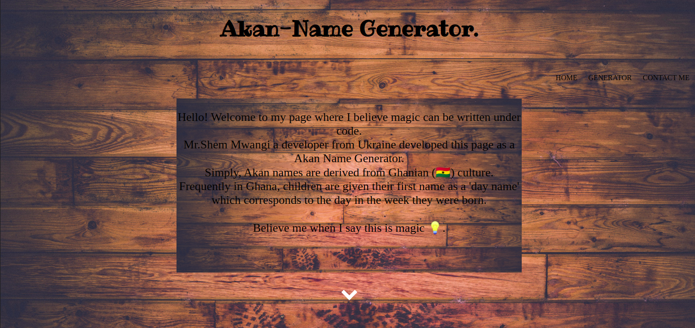
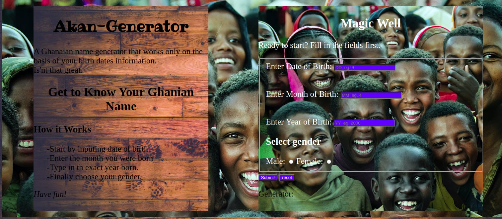
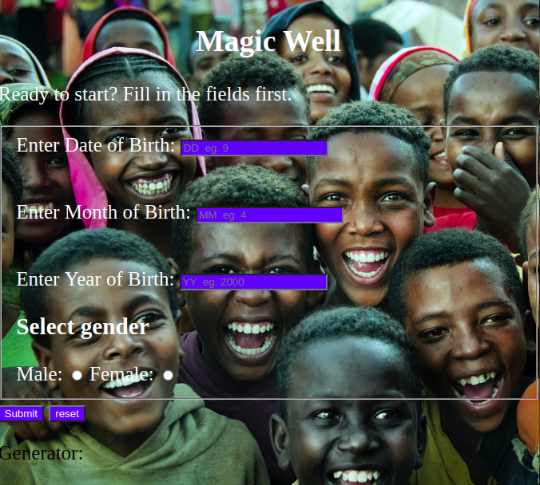

# Akan-Names Generator - Landing Page

This whole structure is created using:

### Technologies used.
- HTML
- css
- JavaScript

## Author
Shem Brooklyne Mwangi

## About
AkanName-Generator is a user interactive web page that generates Akan names (Ghanian) in accordance to the user's birth date and month.
<!-- A Ghanaian name generator that works only on the basis of your birth dates information. -->
## How it Works
Once you click on the link, this is what you'll expect to see.

- This being the main landing page.

The next page contains the Akan-Names Generator section.

- The input section of the generator.

## Setup Instruction

- Visit my Repository: https://shembrooklyne.github.io/AkanName-Generator/
- Go to clone option or download zip
- Choose a suitable directory to extract the files to.
- Run the *index.html* file.

## Visit My Page.
<a href="https://shembrooklyne.github.io/AkanName-Generator/">www.Akan-nameGen.com</a>

Am open for comments. Just reach out to: <a href="mailto:shemnyatti@gmail.com">Shemnyatti@gmail.com</a>

## License
Copyright 2020 Shem Brooklyne

Permission is hereby granted, free of charge, to any person obtaining a copy of this software and associated documentation files (the "Software"), to deal in the Software without restriction, including without limitation the rights to use, copy, modify, merge, publish, distribute, sublicense, and/or sell copies of the Software, and to permit persons to whom the Software is furnished to do so, subject to the following conditions:

The above copyright notice and this permission notice shall be included in all copies or substantial portions of the Software.

THE SOFTWARE IS PROVIDED "AS IS", WITHOUT WARRANTY OF ANY KIND, EXPRESS OR IMPLIED, INCLUDING BUT NOT LIMITED TO THE WARRANTIES OF MERCHANTABILITY, FITNESS FOR A PARTICULAR PURPOSE AND NONINFRINGEMENT. IN NO EVENT SHALL THE AUTHORS OR COPYRIGHT HOLDERS BE LIABLE FOR ANY CLAIM, DAMAGES OR OTHER LIABILITY, WHETHER IN AN ACTION OF CONTRACT, TORT OR OTHERWISE, ARISING FROM, OUT OF OR IN CONNECTION WITH THE SOFTWARE OR THE USE OR OTHER DEALINGS IN THE SOFTWARE.
